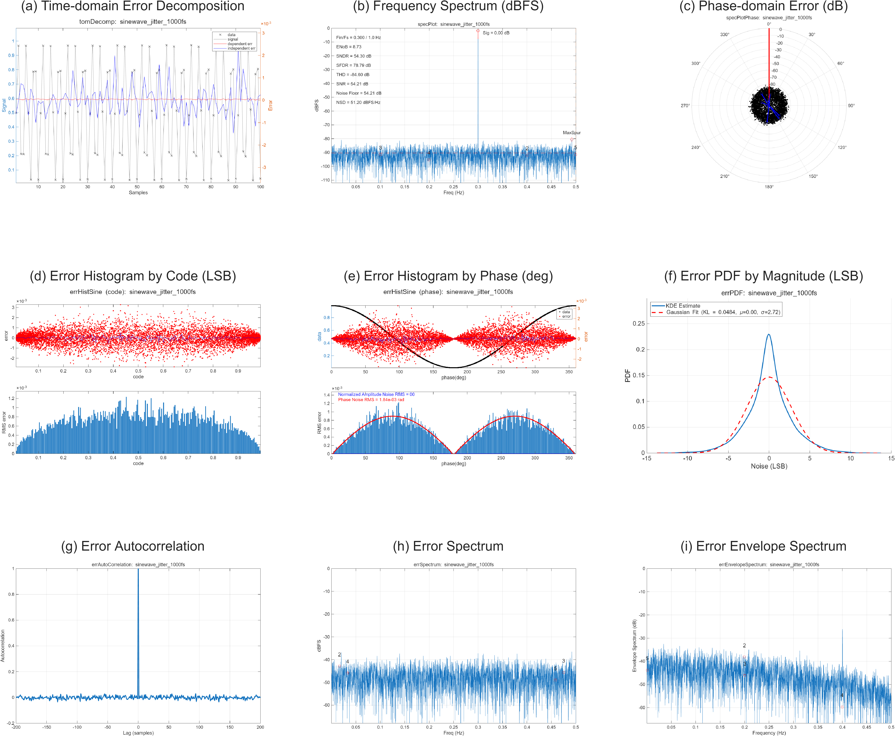

# ADCToolbox

A comprehensive toolbox for **ADC (Analog-to-Digital Converter)** characterization and analysis.
It delivers clear **multi-angle diagnostic views** of ADC behavior, enabling deeper insight and faster issue location.


---

## Features


<p align="center">
  
  <br>
  <em>Example: comprehensive analysis on a sinewave data with 9  views</em>
</p>

- **Spectrum Analysis**: ENOB, SNDR, SFDR, SNR, THD, Noise Floor
- **Error Analysis**: PDF, Autocorrelation, Envelope Spectrum, Histogram Analysis
- **Jitter Detection**: Amplitude vs Phase Noise Decomposition
- **Calibration**: Foreground Calibration, Overflow Detection
- **Utilities**: Sine Fitting, FFT Bin Finder, INL/DNL Extraction

---

## Available Tools

### Spectrum Analysis
- **`spec_plot`** - FFT-based spectrum analysis with ADC performance metrics
  - Calculates ENOB, SNDR, SFDR, SNR, THD, power, noise floor
  - Supports configurable harmonics and oversampling ratio
  - Batch data processing capability
- **`spec_plot_phase`** - Phase spectrum analysis with polar plot visualization
- **`tom_decomp`** - Thompson decomposition (deterministic vs random error separation)

### Error Analysis
- **`err_pdf`** - Error probability density function with KDE estimation
  - Gaussian fitting and KL divergence calculation
  - Noise level quantification in LSB
- **`err_hist_sine`** - Histogram-based error analysis with jitter detection
  - Amplitude vs phase noise decomposition
  - Jitter extraction from phase noise
  - Phase-dependent error characterization
- **`err_auto_correlation`** - Error autocorrelation function
  - Identifies periodic patterns in ADC errors
  - Detects correlations between samples
- **`err_envelope_spectrum`** - Envelope spectrum analysis via Hilbert transform
  - Reveals modulation effects
  - Detects amplitude-dependent distortions

### Common Utilities
- **`sine_fit`** - Multi-parameter sine wave fitting
  - Frequency, magnitude, DC offset, phase estimation
  - Automatic frequency search with coarse/fine tuning
  - Multi-dataset support
- **`inl_sine`** - INL/DNL extraction from sine histogram
  - Integral and differential nonlinearity calculation
  - Histogram-based code density analysis
- **`find_bin`** - FFT bin finder with sub-bin resolution
  - Peak detection in frequency domain
  - Refined frequency estimation
- **`find_fin`** - Input frequency finder from spectrum
- **`alias`** - Frequency aliasing calculator
  - Determines aliased frequency given input and sampling frequency
- **`cap2weight`** - Capacitor array to weight conversion
  - For SAR ADC analysis

### Calibration (Digital Output)
- **`fg_cal_sine`** - Foreground calibration using sinewave input
  - Per-bit weight estimation
  - DC offset calibration
  - Rank-deficient matrix handling
  - Multi-dataset joint calibration
  - Automatic frequency search
- **`fg_cal_sine_os`** - Oversampling calibration variant
- **`overflow_chk`** - Overflow detection and validation
  - Identifies range violations
  - Validates calibration results

### Oversampling Analysis
- **`ntf_analyzer`** - Noise Transfer Function analysis
  - For delta-sigma ADC characterization

---


**Dual Implementation**

MATLAB and Python with 100% numerical parity validated.


**Requirements**:
- Python: numpy, scipy, matplotlib, pandas
- MATLAB: R2018b+, Signal Processing Toolbox

---

## Project Structure

```
ADCToolbox/
├── matlab/src/              # MATLAB implementation
│   ├── aout/                # Analog output analysis
│   ├── common/              # Common utilities
│   └── dout/                # Digital output calibration
├── python/src/adctoolbox/   # Python package
│   ├── aout/                # Analog output analysis
│   ├── common/              # Common utilities
│   ├── dout/                # Digital output calibration
│   ├── oversampling/        # Oversampling analysis
│   └── utils/               # Utility functions
├── dataset/                 # Test datasets (40+ CSV files)
└── python/tests/            # Test suite (15 unit tests)
```

---

## License

MIT License - See LICENSE file for details.

## Citation

If you use this toolbox in your research, please cite:

**Text format**:
```
Zhishuai Zhang, Lu Jie, "ADCToolbox", 2025.
```

**BibTeX format**:
```bibtex
@software{adctoolbox2025,
  author = {Zhang, Zhishuai and Jie, Lu},
  title = {ADCToolbox},
  year = {2025},
  url = {https://github.com/Arcadia-1/ADCToolbox}
}
```
