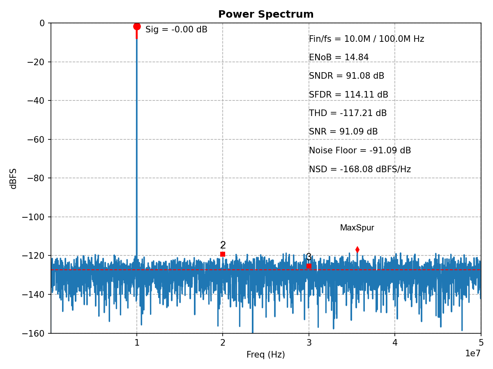

# ADCToolbox

[](https://github.com/Arcadia-1/ADCToolbox/actions/workflows/ci.yml)
[](https://arcadia-1.github.io/ADCToolbox/)
[](https://badge.fury.io/py/adctoolbox)
[](https://pypi.org/project/adctoolbox/)
[](https://www.python.org/downloads/)
[](https://opensource.org/licenses/MIT)
[](https://github.com/Arcadia-1/ADCToolbox/stargazers)


> **A Comprehensive Toolbox for ADC Characterization, Calibration, and Visualization.**
>
> *Unlocking ADC Insights through Multi-Dimensional Analysis.*

## Features

- **Comprehensive Spectrum Analysis**
  - **Full Metric Suite**: Quantifies ENOB, SNDR, SNR, SFDR, THD, NSD, and Noise Floor.
  - **Smart labeling**: Identifies harmonics, noise floor, and OSR bandwidth.
  - **Polar Spectrum**: Visualizes phase-domain errors to isolate static vs. dynamic nonlinearities.
  - **Two-Tone Spectrum**: Supports dual-tone testing with IMD calculation.
  - **Validated Signal Processing**: Includes 8 validated window functions and two spectrum averaging modes (power averaging & complex/coherent averaging)


<div align="center">
  
  <p><em>Example Plot of Spectrum Analysis</em></p>
</div>


- **Multi-dimensional Error Characterization and Visualization**:
  - **Error Rearrangement**: Rearranges errors by value (to estimate INL shape) and by phase (to achieve AM/PM noise separation).
  - **Harmonic Decomposition**: Isolates harmonic components through high-order sine-fitting with time-domain and phase-domain visualization.
  - **Statistical Error Diagnostics**: Analyzes error characteristics through KDE-fitted distributions (with KL divergence quantification), autocorrelation, spectrum, envelope spectrum, and phase plane plots.
  - **Linearity Characterization**: Calculates INL/DNL via histogram-based code analysis and extracts nonlinearity coefficients using 4-parameter sine-fit methods.
  - **Digital Code Analysis**: Monitors bit activity, evaluates the information contribution of individual bits, visualizes weight radix, and detects overflow.


<div align="center">
  
  <p><em>12-panel diagnostic dashboard analyzing a sinewave with jitter noise</em></p>
</div>

> **Note**: ADCToolbox supports automated dashboard generation for 15+ built-in non-ideality cases (including Vref Droop, Memory Effects, and Dynamic Clipping). See the [Gallery](https://arcadia-1.github.io/ADCToolbox/gallery.html) for the full suite.

- **Realistic Signal Modeling**
  - **Chainable Engine**: Implements the Applier Pattern for layered impairment modeling (e.g., sinewave + nonlinearity + noise).
  - **Rich Impairment Models**: Includes aperture jitter, thermal/quantization noise, random walk drift, static nonlinearity, signal-dependent tracking/settling errors, gain error, memory-affected interstage gain (dynamic gain error), Vref droop, modulation, and glitches.

- **Digital Weight Calibration**
  - **Rigorous Linear System**: Formulates bit-weight extraction as a rigorous system of linear equations, solvable via Least-Squares (LS). 
  - **Enhanced Numerical Stability**: Incorporates dual-basis assumptions, rank-deficiency patching, and numerical pre-scaling to handle ill-conditioned matrices.
  - **Enhanced Accuracy & Fidelity**: Supports coarse-fine basis frequency search, multi-dataset/multi-frequency joint calibration, harmonic basis extension


## Installation

```bash
# Install
pip install adctoolbox

# Upgrade if already installed
pip install --upgrade adctoolbox

**Use in your code:**

```python
import numpy as np
import matplotlib.pyplot as plt
from adctoolbox import analyze_spectrum, find_coherent_frequency

# Generate test signal
N = 2**13              # FFT points (8192 samples)
Fs = 100e6             # Sampling frequency: 100 MHz
Fin_target = 10e6      # Input frequency target: 10 MHz
Fin, _ = find_coherent_frequency(fs=Fs, fin_target=Fin_target, n_fft=N)

t = np.arange(N) / Fs
A = 0.5                # Signal amplitude
DC = 0.5               # DC offset
noise_rms = 10e-6      # Noise RMS: 10 uVrms
signal = A * np.sin(2*np.pi*Fin*t) + DC + np.random.randn(N) * noise_rms

# Analyze spectrum
plt.figure(figsize=(8, 6))
result = analyze_spectrum(signal, fs=Fs)

# Access metrics
print(f"ENOB: {result['enob']:.2f} bits")
print(f"SNDR: {result['sndr_db']:.2f} dB")
print(f"SFDR: {result['sfdr_db']:.2f} dB")
print(f"SNR: {result['snr_db']:.2f} dB")

# Show the interactive plot
plt.show()
```


## Explore Examples
**The best way to learn ADCToolbox is through the ready-to-run examples.**

Download all examples in one command:

```bash
mkdir adc_workspace # Prepare a workspace directory
cd adc_workspace    # Move into the workspace

adctoolbox-get-examples # Get all examples in one command
```

Run your first examples:

```bash
python adctoolbox_examples/01_basic/exp_b01_environment_check.py

python adctoolbox_examples/02_spectrum/exp_s01_analyze_spectrum_simplest.py

python adctoolbox_examples/02_spectrum/exp_s02_analyze_spectrum_interactive.py
```

All outputs are saved to the ``output/`` directory within each category.

Please refer to the :doc:`examples/index` for detailed instructions and expected outputs.

## Requirements

- Python >= 3.10
- NumPy >= 1.23.0
- Matplotlib >= 3.6.0
- SciPy >= 1.9.0

## Citation

If you use this toolbox in your research, please cite:

```bibtex
@software{adctoolbox2025,
  author = {Zhang, Zhishuai and Lu, Jie},
  title = {ADCToolbox: Comprehensive ADC Characterization and Analysis Toolkit},
  year = {2025},
  url = {https://github.com/Arcadia-1/ADCToolbox}
}
```

## Authors

- **Zhishuai Zhang**
- **Lu Jie**

## License

MIT License


## Documentation

📚 **[Full Documentation](https://arcadia-1.github.io/ADCToolbox/)** - Complete API reference, algorithm guides, and tutorials

- **[Installation Guide](https://arcadia-1.github.io/ADCToolbox/installation.html)** - Getting started
- **[Quick Start](https://arcadia-1.github.io/ADCToolbox/quickstart.html)** - First steps with examples
- **[Algorithm Reference](https://arcadia-1.github.io/ADCToolbox/algorithms/index.html)** - 15 detailed algorithm guides
- **[API Documentation](https://arcadia-1.github.io/ADCToolbox/api/index.html)** - Function signatures and parameters
- **[Changelog](https://arcadia-1.github.io/ADCToolbox/changelog.html)** - Version history
