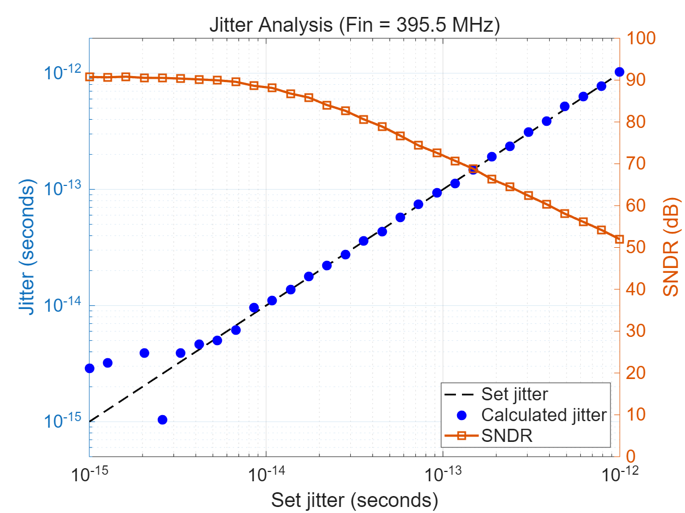
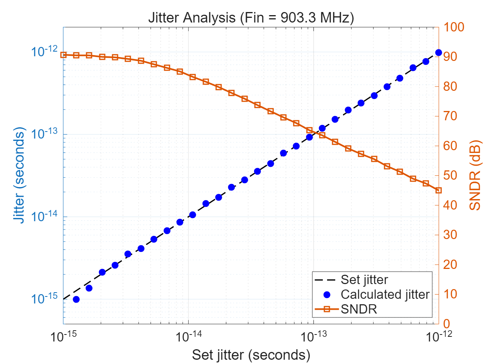
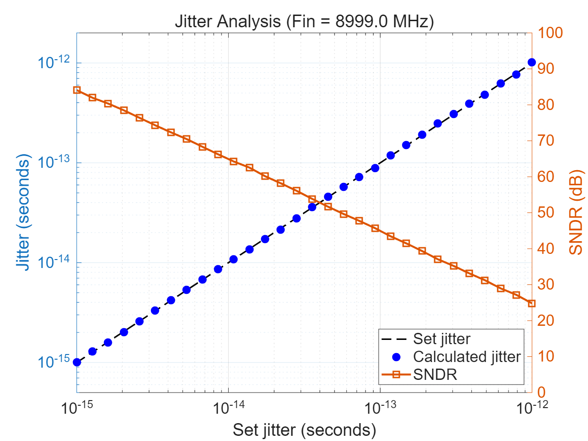

# Jitter Calculation

## Overview

Timing jitter extraction from ADC measurements using phase noise decomposition. Validates jitter calculation accuracy across input frequencies from 400 MHz to 9 GHz.

## Algorithm

### Phase Noise to Jitter Conversion

The RMS timing jitter is calculated from phase noise using:

```
δt_rms = σ_φ / (2π × Fin)
```

where:
- **δt_rms** — RMS timing jitter (seconds)
- **σ_φ** — Phase noise RMS (radians), from `errHistSine`
- **Fin** — Input signal frequency (Hz)

### Calculation Steps

1. **Fit sinewave** to ADC output:
   ```matlab
   [data_fit, f_norm, mag, dc, phi] = sineFit(data);
   Fin = f_norm × Fs;
   ```

2. **Extract phase noise** using error histogram:
   ```matlab
   [~, ~, ~, anoi, pnoi] = errHistSine(data, 99, f_norm, 0);
   ```

3. **Convert to timing jitter**:
   ```matlab
   jitter_rms = pnoi / (2 * pi * Fin);
   ```

## Validation Results

### Test Setup

- **Sampling rate (Fs)**: 10 GSPS
- **Jitter sweep**: 1 fs to 1 ps (logarithmic)
- **Input frequencies**: 395.5 MHz, 903.3 MHz, 8999 MHz
- **Record length**: 4096 samples

### Accuracy vs Frequency



*Figure 1: Jitter extraction at Fin = 395.5 MHz. Calculated jitter (blue) matches set jitter (dashed) across 6 orders of magnitude. SNDR (orange) degrades from 90 dB to 50 dB as jitter increases.*



*Figure 2: Jitter extraction at Fin = 903.3 MHz. Excellent agreement between calculated and set jitter. Higher frequency shows similar SNDR degradation rate.*



*Figure 3: Jitter extraction at Fin = 8999 MHz. At 10× higher frequency, jitter calculation remains accurate. SNDR is more sensitive to jitter due to the 2π·Fin scaling in phase-to-amplitude conversion.*

## Interpretation

### Jitter-SNDR Relationship

At a given jitter level δt_rms, the phase noise contribution to SNDR is:

```
SNDR_jitter = -20·log₁₀(√2 · π · Fin · δt_rms)  [dB]
```

**Key observations from figures:**

1. **Linear jitter extraction** - Calculated jitter follows set jitter with 1:1 slope across all frequencies
2. **Frequency dependence** - SNDR degrades faster at higher Fin for the same jitter:
   - At δt = 100 fs: SNDR ≈ 75 dB @ 400 MHz, 65 dB @ 900 MHz, 45 dB @ 9 GHz
3. **Dynamic range** - Accurate from 1 fs to 1 ps (6 orders of magnitude)

### Jitter-Limited ENOB

The effective number of bits limited by aperture jitter:

```
ENOB_jitter = log₂(1 / (√2 · π · Fin · δt_rms))
```

**Example:** At Fin = 9 GHz with δt_rms = 100 fs:
- ENOB_jitter = 7.3 bits
- SNDR_jitter = 45.7 dB

This matches the SNDR crossover point in Figure 3.

## Usage Example

### Jitter Sweep Analysis

```matlab
% Configuration
Fs = 10e9;  % 10 GSPS
Fin = 900e6;  % 900 MHz input
jitter_sweep = logspace(-15, -12, 20);  % 1 fs to 1 ps

meas_jitter = zeros(size(jitter_sweep));
meas_SNDR = zeros(size(jitter_sweep));

% Analyze each jitter level
for i = 1:length(jitter_sweep)
    % Generate or load data with known jitter
    data = load_jittered_data(jitter_sweep(i), Fin, Fs);

    % Fit sinewave
    [~, f_norm, ~, ~, ~] = sineFit(data);
    Fin_fit = f_norm * Fs;

    % Extract phase noise
    [~, ~, ~, anoi, pnoi] = errHistSine(data, 99, f_norm, 0);

    % Calculate jitter
    meas_jitter(i) = pnoi / (2 * pi * Fin_fit);

    % Measure SNDR
    [~, SNDR] = specPlot(data, 'harmonic', 0, 'isPlot', 0);
    meas_SNDR(i) = SNDR;
end

% Plot validation
figure;
yyaxis left
loglog(jitter_sweep, jitter_sweep, 'k--', 'LineWidth', 1.5);
hold on;
loglog(jitter_sweep, meas_jitter, 'bo', 'MarkerSize', 8, 'MarkerFaceColor', 'b');
ylabel('Jitter (seconds)');

yyaxis right
semilogx(jitter_sweep, meas_SNDR, 's-', 'LineWidth', 2);
ylabel('SNDR (dB)');

xlabel('Set jitter (seconds)');
grid on;
```

## Theoretical Background

### Phase-to-Voltage Conversion

Timing jitter δt causes a voltage error:

```
ΔV(t) = A · [sin(ωt + φ + Δφ) - sin(ωt + φ)]
      ≈ A · cos(ωt + φ) · Δφ    for small Δφ
```

where Δφ = ω·δt = 2π·Fin·δt

**RMS voltage error** from Gaussian jitter:

```
σ_V = A · 2π·Fin·δt_rms / √2
```

**SNR from jitter:**

```
SNR_jitter = 20·log₁₀(A/√2 / σ_V)
           = -20·log₁₀(√2 · π · Fin · δt_rms)
```

### Phase Noise Decomposition

The `errHistSine` function decomposes the RMS error into amplitude and phase components by fitting:

```
σ²(θ) = σ²_A · cos²(θ) + (A·σ_φ)²·sin²(θ) + baseline
```

where:
- **θ** — Signal phase
- **σ²(θ)** — RMS error variance at phase θ
- **σ_A** — Amplitude noise (anoi)
- **σ_φ** — Phase noise (pnoi)
- **A** — Signal amplitude

**Physical meaning:**
- Amplitude noise dominates near peaks (cos²θ ≈ 1)
- Phase noise dominates near zero crossings (sin²θ ≈ 1)

## Limitations

1. **Single-tone requirement** - Algorithm assumes pure sinewave input
2. **Coherent sampling** - Best accuracy with integer number of cycles
3. **Noise floor** - Cannot distinguish jitter below amplitude noise:
   ```
   δt_min ≈ σ_A / (2π·Fin·A)
   ```
4. **High-frequency limit** - At very high Fin, quantization noise may dominate

## Applications

- **ADC aperture jitter characterization**
- **Clock jitter measurement**
- **Track-and-hold performance validation**
- **Jitter-limited ENOB prediction**
- **Phase noise analysis**

## See Also

- [`errHistSine`](errHistSine.md) — Phase noise extraction
- [`sineFit`](sineFit.md) — Sinewave parameter estimation
- [`specPlot`](specPlot.md) — SNDR measurement
- [`tomDecomp`](tomDecomp.md) — Error decomposition

## References

1. Brannon, B. "Sampled Systems and the Effects of Clock Phase Noise and Jitter," Analog Devices AN-756
2. IEEE Std 1241-2010, "IEEE Standard for Terminology and Test Methods for ADCs"
3. Walden, R.H. "Analog-to-Digital Converter Survey and Analysis," IEEE Journal on Selected Areas in Communications, 1999
