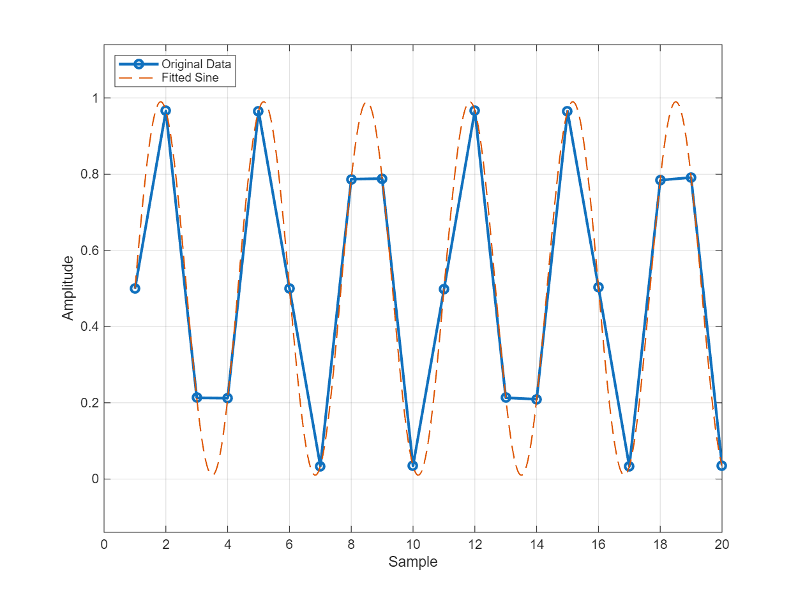

# sineFit

## Overview

`sineFit` fits a pure sinewave to ADC output using iterative least-squares with frequency refinement. Simpler than FGCalSine—no bit-level calibration, just signal fitting.

## Syntax

```matlab
[data_fit, freq, mag, dc, phi] = sineFit(data)
[data_fit, freq, mag, dc, phi] = sineFit(data, f0)
[data_fit, freq, mag, dc, phi] = sineFit(data, f0, tol, rate)
```

## Input Arguments

- **`data`** — ADC output signal (1×N or N×1 vector)
- **`f0`** — Initial frequency estimate (Fin/Fs), optional
  - If omitted: auto-detect using FFT peak with parabolic interpolation
- **`tol`** — Convergence tolerance, default: `1e-12`
- **`rate`** — Frequency update rate (0-1), default: `0.5`

## Output Arguments

- **`data_fit`** — Fitted sinewave (1×N vector)
- **`freq`** — Refined frequency (Fin/Fs)
- **`mag`** — Signal magnitude: `sqrt(A² + B²)`
- **`dc`** — DC offset
- **`phi`** — Phase (radians): `-atan2(B, A)`

## Algorithm

### 1. Frequency Initialization (if `f0` not provided)

**FFT-based coarse estimate** with 3-point interpolation:
```matlab
spec = abs(fft(data))
[peak, k0] = max(spec(2 : N/2))  % Exclude DC
direction = sign(spec(k0+1) - spec(k0-1))
f0 = (k0 - 1 + direction × spec(k0 + direction) / (spec(k0) + spec(k0 + direction))) / N
```

### 2. Iterative Least-Squares Refinement

For `iter = 1:100`:

**Step 1**: Solve for `[A, B, DC, δf]` via augmented least-squares:
```
[cos(θ), sin(θ), ones, ∂/∂freq] × [A; B; DC; δf] = data
```
where:
- `θ = 2π × freq × (0:N-1)`
- `∂/∂freq = (-A × 2π × t .* sin(θ) + B × 2π × t .* cos(θ)) / N`

**Step 2**: Update frequency with damping:
```
freq ← freq + δf × rate / N
```

**Step 3**: Check convergence:
```
rel_error = RMS(δf/N × ∂column) / sqrt(A² + B²)
if rel_error < tol: break
```

### 3. Parameter Extraction

```matlab
mag = sqrt(A² + B²)
phi = -atan2(B, A)  % Negative for phase lag convention
data_fit = A × cos(θ) + B × sin(θ) + DC
```

## Examples

### Example 1: Auto-Detect Frequency

```matlab
data = adc_output;
[fit, freq, mag, dc, phi] = sineFit(data);
fprintf('Freq: %.6f, Mag: %.3f, Phase: %.2f°\n', freq, mag, rad2deg(phi));
```

### Example 2: Known Frequency

```matlab
f0 = 0.1234;  % Known Fin/Fs
[fit, freq] = sineFit(data, f0);
error = data - fit;
fprintf('Fit RMS error: %.4f\n', rms(error));
```

### Example 3: Tight Tolerance

```matlab
[fit, freq] = sineFit(data, [], 1e-15, 0.3);  % tol=1e-15, rate=0.3
```

### Example 4: Reconstruct Fitted Sinewave from Parameters

To visualize the fit quality, reconstruct a smooth sinewave from the fitted parameters:

```matlab
% Load data and fit
data = readmatrix('dataset/sinewave_jitter_1000fs.csv');
[data_fit, freq, mag, dc, phi] = sineFit(data);

% Plot one period
period = round(1/freq);
n_samples = min(max(period, 20), length(data));
t = 1:n_samples;

% Reconstruct smooth fitted sinewave (10x denser)
t_dense = linspace(1, n_samples, n_samples*100);
fitted_sine = mag * cos(2*pi*freq*(t_dense-1) + phi) + dc;

% Plot comparison
figure('Position', [100, 100, 800, 600]);
plot(t, data(1:n_samples), '-o', 'LineWidth', 2, 'DisplayName', 'Original Data');
hold on;
plot(t_dense, fitted_sine, '--', 'LineWidth', 1, 'DisplayName', 'Fitted Sine');
xlabel('Sample');
ylabel('Amplitude');
legend('Location', 'northwest');
grid on;
ylim([min(fitted_sine)-0.15, max(fitted_sine)+0.15]);
```

**Key points:**
- Use **`cos`**, not `sin`, to match sineFit's model: `A*cos(θ) + B*sin(θ) + dc`
- Use **0-indexed** time: `(t_dense-1)` because sineFit uses `time = (0:N-1)'`
- The reconstruction formula: `mag * cos(2*pi*freq*(n-1) + phi) + dc` where `n` is the 1-indexed sample number



*Figure: Original data (blue circles) vs. fitted sinewave (orange dashed) showing excellent agreement over one period.*

## Interpretation

| Output | Interpretation |
|--------|----------------|
| `mag / max(data)` ≈ 1 | Full-scale sinewave input |
| `|dc| << mag` | Well-centered signal |
| `|dc| ≈ mag` | Large DC offset, check ADC biasing |
| High RMS(data - fit) | Distortion or noise present |

## Comparison: sineFit vs FGCalSine

| Feature | sineFit | FGCalSine |
|---------|---------|-----------|
| **Purpose** | Fit sinewave to signal | Calibrate ADC bit weights |
| **Input** | Analog signal | Digital bit matrix |
| **Output** | Fitted waveform | Calibrated weights + waveform |
| **Complexity** | Simple, fast | Handles rank deficiency, multi-dataset |
| **Use case** | Error analysis, signal characterization | ADC calibration |

## Limitations

- **Single-tone only**: Assumes pure sinewave; fails with multi-tone or modulated inputs
- **No distortion modeling**: Harmonics treated as noise in residual
- **Convergence**: May fail to converge if initial `f0` far from true frequency

## See Also

- [`FGCalSine`](FGCalSine.md) — ADC bit-weight calibration
- [`findFin`](findFin.md) — Frequency estimation tool
- [`tomDecomp`](tomDecomp.md) — Time-domain error decomposition using sineFit

## References

1. IEEE Std 1057-2017, "IEEE Standard for Digitizing Waveform Recorders"
