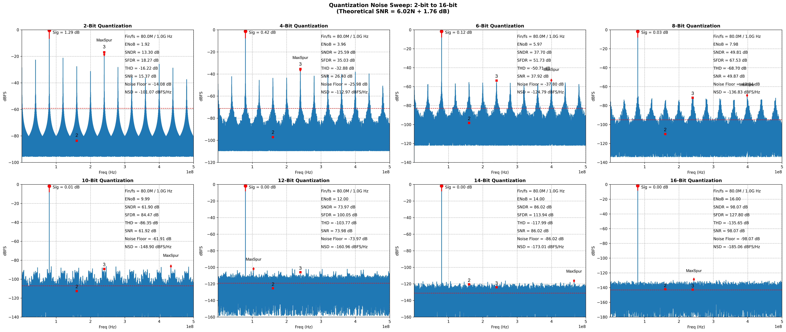

Expected Output: 03_generate_signals
==========================================

This document shows the expected console output and example figures from all examples in `python/src/adctoolbox/examples/03_generate_signals/`.

Summary
-------

All examples in `03_generate_signals` demonstrate various signal generation capabilities:

1. **exp_g01**: Thermal noise effects on signal quality (4 test cases)
2. **exp_g03**: Quantization noise scaling (2-16 bits, 8 test cases)
3. **exp_g04**: Jitter-induced SNR degradation (0.2-32 GHz, 8 test cases)
4. **exp_g05**: Static nonlinearity harmonic distortion (4 sign combinations)
5. **exp_g06**: Isolated nonlinearity effects (8 different types)
6. **exp_g07**: Interference effects on spectrum (8 interference types)

**Total Examples**: 6
**Total Test Cases**: 40 different signal conditions analyzed

exp_g01_generate_signal_demo.py
-------------------------------

**Description**: Demonstrate thermal noise effect on signal spectrum.

.. code-block:: none

   [Sinewave] Fs=[100.00 MHz], Fin=[12.00 MHz], Bin/N=[983/8192], A=[0.500 Vpeak]
   
   Thermal Noise Demo - Single Signal Comparison
   ================================================================================
   
   Clean signal (no noise): Ideal performance
   Noise RMS=    50 uV: SNR_theory= 76.99 dB, NSD_theory=-153.98 dBFS/Hz
   Noise RMS=   100 uV: SNR_theory= 70.97 dB, NSD_theory=-147.96 dBFS/Hz
   Noise RMS=   200 uV: SNR_theory= 64.95 dB, NSD_theory=-141.94 dBFS/Hz
   
   ================================================================================
   Measured Spectrum Analysis:
   ================================================================================
   1. Clean Sinewave (No Noise)           | ENOB=24.12b | SNR=150.00dB | SNDR=146.99dB | NSD=-226.99dBFS/Hz
   2. Thermal Noise: RMS=50 uV            | ENOB=12.50b | SNR= 77.01dB | SNDR= 77.00dB | NSD=-154.00dBFS/Hz
   3. Thermal Noise: RMS=100 uV           | ENOB=11.51b | SNR= 71.04dB | SNDR= 71.02dB | NSD=-148.03dBFS/Hz
   4. Thermal Noise: RMS=200 uV           | ENOB=10.51b | SNR= 65.04dB | SNDR= 65.03dB | NSD=-142.03dBFS/Hz
   
   [Save figure] -> [D:\ADCToolbox\python\src\adctoolbox\examples\03_generate_signals\output\exp_g01_generate_signal_demo_thermal_noise.png]

.. figure:: figures/exp_g01_generate_signal_demo_thermal_noise.png
   :alt: Thermal noise effect on signal
   :align: center
   :width: 600px

   Impact of thermal noise on spectrum and signal quality

exp_g03_sweep_quant_bits.py
---------------------------

**Description**: Sweep quantization bits to analyze how noise floor changes with ADC resolution.

.. code-block:: none

   [Setup] Fs=1000MHz, Fin=80.00MHz
   [Setup] Sweeping Quantization Bits: 2, 4, 6, 8, 10, 12, 14, 16
   ============================================================
   Bits   | ENOB     | SNR (dB)   | Theory SNR
   ------------------------------------------------------------
   2      | 1.92     | 15.37      | 13.80
   4      | 3.96     | 26.40      | 25.84
   6      | 5.97     | 37.92      | 37.88
   8      | 7.98     | 49.87      | 49.92
   10     | 9.99     | 61.92      | 61.96
   12     | 12.00    | 73.98      | 74.00
   14     | 14.00    | 86.02      | 86.04
   16     | 16.00    | 98.07      | 98.08
   
   [Save fig] -> [D:\ADCToolbox\python\src\adctoolbox\examples\03_generate_signals\output\exp_g03_sweep_quant_bits.png]

   SNR degradation due to quantization noise (2-16 bit resolution sweep)

exp_g04_sweep_jitter_fin.py
---------------------------

**Description**: Sweep input frequency to analyze sampling jitter impact on SNR.

.. code-block:: none

   [Setup] Fs=128GHz, N=8192
   [Setup] Fixed Jitter RMS = 50.0 fs
   ===========================================================================
   Fin (GHz)  | Meas SNR   | Theory SNR   | Meas ENOB
   ---------------------------------------------------------------------------
   0.2        | 82.71      | 82.66        | 13.44
   0.5        | 76.45      | 76.35        | 12.41
   1.0        | 70.12      | 70.19        | 11.35
   2.0        | 64.36      | 64.10        | 10.40
   4.0        | 57.92      | 58.05        | 9.33
   8.0        | 51.88      | 52.01        | 8.32
   16.0       | 45.98      | 45.98        | 7.34
   32.0       | 39.91      | 39.96        | 6.33
   
   [Save fig] -> [D:\ADCToolbox\python\src\adctoolbox\examples\03_generate_signals\output\exp_g04_sweep_jitter_fin.png]

exp_g05_sweep_static_nonlin.py
------------------------------

**Description**: Sweep static nonlinearity coefficients to analyze harmonic distortion.

.. code-block:: none

   ================================================================================
   Case Title           | SFDR (dB)  | THD (dB)   | HD2 (Meas)   | HD3 (Meas)
   --------------------------------------------------------------------------------
   k2(+), k3(+)         | 80.10      | -79.65     | -89.75       | -80.10
   k2(-), k3(+)         | 79.96      | -79.55     | -89.89       | -79.97
   k2(+), k3(-)         | 79.99      | -79.53     | -89.49       | -79.99
   k2(-), k3(-)         | 80.09      | -79.68     | -90.20       | -80.09
   
   [Save figure] -> [D:\ADCToolbox\python\src\adctoolbox\examples\03_generate_signals\output\exp_g05_sweep_nonlinear_sign_fixed.png]

exp_g06_sweep_dynamic_nonlin.py
-------------------------------

**Description**: Compare isolated nonlinearity effects on ADC spectrum.

.. code-block:: none

   [Setup] Fs=1000 MHz | N=8192 | Fin=79.96 MHz
   [Setup] Target HD3 = -80.0 dBc -> k3 = 1.6000e-03
   ===============================================================================================
   Exp  | Non-Ideality                        | SFDR (dB)  | THD (dB)
   -----------------------------------------------------------------------------------------------
   1    | Static HD3 Only (-80 dBc)           | 79.98      | -79.98
   2    | Incomplete Settling (+0.005)        | 80.19      | -80.18
   3    | Memory Effect (+0.005)              | 81.26      | -79.91
   4    | Memory Effect (-0.005)              | 81.13      | -78.99
   5    | RA Static Gain (+0.5%)              | 81.11      | -78.54
   6    | RA Static Gain (-0.5%)              | 81.21      | -80.38
   7    | RA Dynamic Gain (+0.5%)             | 70.42      | -70.30
   8    | RA Dynamic Gain (-0.5%)             | 70.25      | -70.19
   
   [Save figure] -> D:\ADCToolbox\python\src\adctoolbox\examples\03_generate_signals\output\exp_g06_sweep_dynamic_nonlinearity.png

exp_g07_sweep_interferences.py
------------------------------

**Description**: Sweep different interference types to show effects on ADC spectrum.

.. code-block:: none

   [Setup] Fs=1000 MHz | N=8192 | Fin=79.96 MHz (Coherent)
   [Setup] A=0.50V | DC=0.00V | base_noise=10.00uV
   
   ====================================================================================================
   #   | Interference Type                   | SFDR (dB)  | THD (dB)   | SNR (dB)
   ----------------------------------------------------------------------------------------------------
   1   | Clean Signal (reference)            | 112.17     | -113.30    | 90.72
   2   | Glitch (prob=0.05%, amp=0.1)        | 72.38      | -68.55     | 43.80
   3   | AM Tone (500 kHz, 0.05%)            | 72.03      | -115.72    | 68.99
   4   | AM Noise (strength=0.1%)            | 83.68      | -84.95     | 60.05
   5   | Clipping (level=1%)                 | 97.13      | -94.26     | 82.58
   6   | Clipping (level=2%)                 | 79.55      | -76.56     | 68.72
   7   | Drift (scale=2e-5)                  | 63.64      | -116.58    | 63.83
   8   | Reference Error (tau=2.0, droop=0.01) | 59.08      | -59.03     | 83.52
   
   [Save figure] -> [D:\ADCToolbox\python\src\adctoolbox\examples\03_generate_signals\output\exp_g07_sweep_interferences.png]

---
