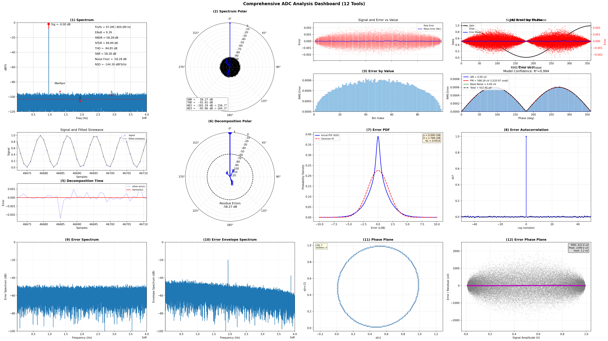
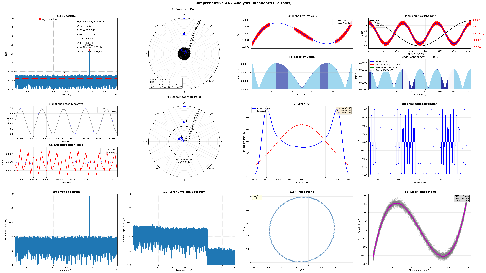

Example Print Outputs: 06_use_toolsets
======================================

This document records the console output from all examples in `python/src/adctoolbox/examples/06_use_toolsets/`.

Summary
-------

All examples in `06_use_toolsets` demonstrate comprehensive dashboard generation:

**Total Examples**: 4

**Categories**:
- **Analog Output Dashboards**: exp_t01-t02 (single and batch, 12 tools per dashboard)
- **Digital Output Dashboards**: exp_t03-t04 (single and batch, 6 tools per dashboard)

**Analog Dashboard (12 Tools)**:
1. Spectrum
2. Spectrum Polar
3. Error by Value
4. Error by Phase
5. Decomposition Time
6. Decomposition Polar
7. Error PDF
8. Error Autocorrelation
9. Error Spectrum
10. Error Envelope Spectrum
11. Phase Plane
12. Error Phase Plane

**Digital Dashboard (6 Tools)**:
1. Spectrum: Nominal Weights
2. Spectrum: Calibrated Weights
3. Bit Activity
4. Overflow Check
5. ENOB Bit Sweep
6. Weight Radix

**Key Features**:
- Comprehensive all-in-one debugging dashboards
- Batch processing for multiple test cases
- 15 analog non-ideality types analyzed
- 7 digital configuration types analyzed

---

exp_t01_aout_dashboard_single.py
--------------------------------

**Description**: Generate a single comprehensive 12-tool analog output dashboard.

.. code-block:: none

   [Config] Fs=800 MHz, Fin=10.00 MHz, Bin/N=[819/65536], Resolution=12 bits
   [Config] Signal: A=0.490 V, DC=0.500 V, Noise RMS=50.00 uVrms
   [Dashboard saved] -> D:\ADCToolbox\python\src\adctoolbox\examples\06_use_toolsets\output\exp_t01_aout_dashboard.png

---

exp_t02_aout_dashboard_batch.py
-------------------------------

**Description**: Generate batch of 15 comprehensive dashboards for different non-idealities.

.. code-block:: none

   [Config] Fs=800 MHz, Fin=97.0 MHz, Bin=7947, N=65536
   [Config] A=0.490 V, DC=0.500 V, Resolution=12 bits
   
   
   ====================================================================================================
   #    | Non-Ideality                   | Status                                   | Time (s)
   ----------------------------------------------------------------------------------------------------
   [Dashboard saved] -> D:\ADCToolbox\python\src\adctoolbox\examples\06_use_toolsets\output\exp_t02_dashboard_01_Thermal_Noise.png
   1    | Thermal Noise                  | exp_t02_dashboard_01_Thermal_Noise.png   | 4.763
   [Dashboard saved] -> D:\ADCToolbox\python\src\adctoolbox\examples\06_use_toolsets\output\exp_t02_dashboard_02_Quantization_Noise.png
   2    | Quantization Noise             | exp_t02_dashboard_02_Quantization_Noise.png | 4.892
   [Dashboard saved] -> D:\ADCToolbox\python\src\adctoolbox\examples\06_use_toolsets\output\exp_t02_dashboard_03_Jitter_Noise.png
   3    | Jitter Noise                   | exp_t02_dashboard_03_Jitter_Noise.png    | 4.659
   [Dashboard saved] -> D:\ADCToolbox\python\src\adctoolbox\examples\06_use_toolsets\output\exp_t02_dashboard_04_AM_Noise.png
   4    | AM Noise                       | exp_t02_dashboard_04_AM_Noise.png        | 2.924
   [Dashboard saved] -> D:\ADCToolbox\python\src\adctoolbox\examples\06_use_toolsets\output\exp_t02_dashboard_05_Static_HD2_-80_dBc.png
   5    | Static HD2 (-80 dBc)           | exp_t02_dashboard_05_Static_HD2_-80_dBc.png | 2.738
   [Dashboard saved] -> D:\ADCToolbox\python\src\adctoolbox\examples\06_use_toolsets\output\exp_t02_dashboard_06_Static_HD3_-70_dBc.png
   6    | Static HD3 (-70 dBc)           | exp_t02_dashboard_06_Static_HD3_-70_dBc.png | 3.007
   [Dashboard saved] -> D:\ADCToolbox\python\src\adctoolbox\examples\06_use_toolsets\output\exp_t02_dashboard_07_Memory_Effect.png
   7    | Memory Effect                  | exp_t02_dashboard_07_Memory_Effect.png   | 3.810
   [Dashboard saved] -> D:\ADCToolbox\python\src\adctoolbox\examples\06_use_toolsets\output\exp_t02_dashboard_08_Incomplete_Settling.png
   8    | Incomplete Settling            | exp_t02_dashboard_08_Incomplete_Settling.png | 5.530
   [Dashboard saved] -> D:\ADCToolbox\python\src\adctoolbox\examples\06_use_toolsets\output\exp_t02_dashboard_09_RA_Gain_Error.png
   9    | RA Gain Error                  | exp_t02_dashboard_09_RA_Gain_Error.png   | 9.085
   [Dashboard saved] -> D:\ADCToolbox\python\src\adctoolbox\examples\06_use_toolsets\output\exp_t02_dashboard_10_RA_Dynamic_Gain.png
   10   | RA Dynamic Gain                | exp_t02_dashboard_10_RA_Dynamic_Gain.png | 9.169
   [Dashboard saved] -> D:\ADCToolbox\python\src\adctoolbox\examples\06_use_toolsets\output\exp_t02_dashboard_11_AM_Tone.png
   11   | AM Tone                        | exp_t02_dashboard_11_AM_Tone.png         | 17.862
   [Dashboard saved] -> D:\ADCToolbox\python\src\adctoolbox\examples\06_use_toolsets\output\exp_t02_dashboard_12_Clipping.png
   12   | Clipping                       | exp_t02_dashboard_12_Clipping.png        | 17.341
   [Dashboard saved] -> D:\ADCToolbox\python\src\adctoolbox\examples\06_use_toolsets\output\exp_t02_dashboard_13_Drift.png
   13   | Drift                          | exp_t02_dashboard_13_Drift.png           | 14.287
   [Dashboard saved] -> D:\ADCToolbox\python\src\adctoolbox\examples\06_use_toolsets\output\exp_t02_dashboard_14_Reference_Error.png
   14   | Reference Error                | exp_t02_dashboard_14_Reference_Error.png | 3.517
   [Dashboard saved] -> D:\ADCToolbox\python\src\adctoolbox\examples\06_use_toolsets\output\exp_t02_dashboard_15_Glitch.png
   15   | Glitch                         | exp_t02_dashboard_15_Glitch.png          | 3.532
   ====================================================================================================
   
   
   ====================================================================================================
   Dashboard Generation Complete!
   ----------------------------------------------------------------------------------------------------
   Generated 15 comprehensive 12-tool dashboards
   Each dashboard includes:
     1. Spectrum                    7. Error PDF
     2. Spectrum Polar              8. Error Autocorrelation
     3. Error by Value              9. Error Spectrum
     4. Error by Phase             10. Error Envelope Spectrum
     5. Decomposition Time         11. Phase Plane
     6. Decomposition Polar        12. Error Phase Plane

   Output directory: D:\ADCToolbox\python\src\adctoolbox\examples\06_use_toolsets\output
   ====================================================================================================

**Example Dashboard Figures:**

.. figure:: figures/exp_t02_dashboard_01_Thermal_Noise.png
   :alt: Dashboard - Thermal Noise Analysis
   :align: center
   :width: 800px

   Thermal Noise: Comprehensive 12-tool analysis dashboard

   Jitter Noise: Phase noise and timing jitter effects

   Static HD3 (-70 dBc): Third harmonic distortion analysis

.. figure:: figures/exp_t02_dashboard_10_RA_Dynamic_Gain.png
   :alt: Dashboard - RA Dynamic Gain
   :align: center
   :width: 800px

   RA Dynamic Gain: Residue amplifier dynamic gain variation

---

exp_t03_dout_dashboard_single.py
--------------------------------

**Description**: Generate a single comprehensive 6-tool digital output dashboard.

.. code-block:: none

   [Config] Fs=1000 MHz, Fin=299.93 MHz, Bin/N=[2457/8192], Resolution=12 bits
   [Config] Signal: A=0.490, DC=0.500
   [Dashboard saved] -> D:\ADCToolbox\python\src\adctoolbox\examples\06_use_toolsets\output\exp_t03_dout_dashboard.png

---

exp_t04_dout_dashboard_batch.py
-------------------------------

**Description**: Generate batch of 7 digital output dashboards for different configurations.

.. code-block:: none

   [Config] Fs=1000 MHz, Fin=299.93 MHz, Bin/N=[2457/8192]
   [Config] Signal: A=0.490, DC=0.500
   
   
   ====================================================================================================
   #    | Test Case                                | Status                                   | Time (s)
   ----------------------------------------------------------------------------------------------------
   [Dashboard saved] -> D:\ADCToolbox\python\src\adctoolbox\examples\06_use_toolsets\output\exp_t04_dashboard_01_Ideal_Binary_8-bit.png
   1    | Ideal Binary 8-bit                       | exp_t04_dashboard_01_Ideal_Binary_8-bit.png | 1.178
   [Dashboard saved] -> D:\ADCToolbox\python\src\adctoolbox\examples\06_use_toolsets\output\exp_t04_dashboard_02_Ideal_Binary_10-bit.png
   2    | Ideal Binary 10-bit                      | exp_t04_dashboard_02_Ideal_Binary_10-bit.png | 1.221
   [Dashboard saved] -> D:\ADCToolbox\python\src\adctoolbox\examples\06_use_toolsets\output\exp_t04_dashboard_03_Ideal_Binary_12-bit.png
   3    | Ideal Binary 12-bit                      | exp_t04_dashboard_03_Ideal_Binary_12-bit.png | 1.328
   [Dashboard saved] -> D:\ADCToolbox\python\src\adctoolbox\examples\06_use_toolsets\output\exp_t04_dashboard_04_Binary_12-bit_with_Thermal_Noise_50uV.png
   4    | Binary 12-bit + Thermal Noise (50uV)     | exp_t04_dashboard_04_Binary_12-bit_with_Thermal_Noise_50uV.png | 1.403
   [Dashboard saved] -> D:\ADCToolbox\python\src\adctoolbox\examples\06_use_toolsets\output\exp_t04_dashboard_05_Binary_12-bit_with_Thermal_Noise_200uV.png
   5    | Binary 12-bit + Thermal Noise (200uV)    | exp_t04_dashboard_05_Binary_12-bit_with_Thermal_Noise_200uV.png | 1.339
   [Dashboard saved] -> D:\ADCToolbox\python\src\adctoolbox\examples\06_use_toolsets\output\exp_t04_dashboard_06_Binary_12-bit_with_LSB_Random.png
   6    | Binary 12-bit + LSB Random               | exp_t04_dashboard_06_Binary_12-bit_with_LSB_Random.png | 1.350
   [Dashboard saved] -> D:\ADCToolbox\python\src\adctoolbox\examples\06_use_toolsets\output\exp_t04_dashboard_07_SAR_12-bit_with_Thermal_Noise.png
   7    | SAR 12-bit + Thermal Noise               | exp_t04_dashboard_07_SAR_12-bit_with_Thermal_Noise.png | 1.350
   ====================================================================================================
   
   
   ====================================================================================================
   Dashboard Generation Complete!
   ----------------------------------------------------------------------------------------------------
   Generated 7 comprehensive 6-tool dashboards
   Each dashboard includes:
     1. Spectrum: Nominal Weights
     2. Spectrum: Calibrated Weights
     3. Bit Activity
     4. Overflow Check
     5. ENOB Bit Sweep
     6. Weight Radix
   
   Output directory: D:\ADCToolbox\python\src\adctoolbox\examples\06_use_toolsets\output
   ====================================================================================================

---
