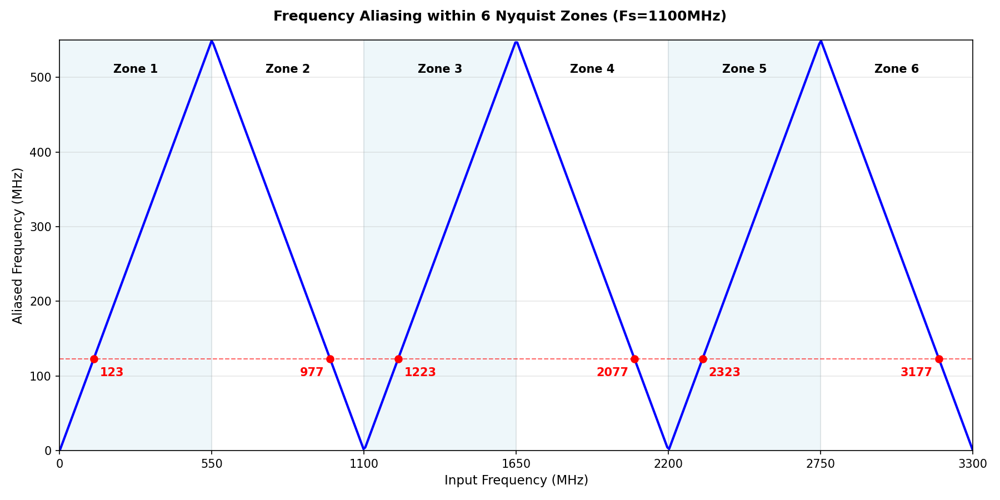

Example Print Outputs: 07_conversions
======================================

This document records the console output from all examples in `python/src/adctoolbox/examples/07_conversions/`.

Summary
-------

All examples in `07_conversions` demonstrate unit conversions and metric calculations:

1. **exp_c01**: Aliasing and Nyquist zone calculations
2. **exp_c02**: Comprehensive unit conversions (9 conversion categories with round-trip validation)
3. **exp_c03**: ADC figure of merit calculations (Walden FOM, Schreier FOM, performance limits)
4. **exp_c04**: Signal/noise amplitude to SNR conversions
5. **exp_c05**: Noise spectral density (NSD) and SNR conversions

**Total Examples**: 5

---

exp_c01_aliasing_nyquist_zones.py
----------------------------------

**Description**: Demonstrate aliasing and Nyquist zone calculations.

.. code-block:: none

   [Aliasing] Fs = 1100.0 MHz, Fin_target = 123.0 MHz -> F_aliased = 123.0 MHz
   [Aliasing 500 frequencies] [Input = 0.0 - 3300.0 MHz] [Output = 0.00 - 548.90 MHz]

   [Save fig] -> [D:\ADCToolbox\python\src\adctoolbox\examples\07_conversions\output\exp_c01_aliasing.png]

   Frequency aliasing visualization across multiple Nyquist zones

---

exp_c02_unit_conversions.py
---------------------------

**Description**: Comprehensive unit conversion utilities for ADC testing.

.. code-block:: none

   [Unit Conversions for ADC Testing]

   [1a. dB -> Magnitude -> dB]
     [dB =  -80] -> [mag = 0.000100] -> [dB = -80.00]
     [dB =  -70] -> [mag = 0.000316] -> [dB = -70.00]
     [dB =  -60] -> [mag = 0.001000] -> [dB = -60.00]
     [dB =  -40] -> [mag = 0.010000] -> [dB = -40.00]
     [dB =  -20] -> [mag = 0.100000] -> [dB = -20.00]

   [1b. Magnitude -> dB -> Magnitude]
     [mag = 0.000100] -> [dB = -80.00] -> [mag = 0.000100]
     [mag = 0.001000] -> [dB = -60.00] -> [mag = 0.001000]
     [mag = 0.010000] -> [dB = -40.00] -> [mag = 0.010000]
     [mag = 0.100000] -> [dB = -20.00] -> [mag = 0.100000]
     [mag = 1.000000] -> [dB =   0.00] -> [mag = 1.000000]

   [2a. dB -> Power -> dB]
     [dB =   0] -> [power =      1.0x] -> [dB =   0.00]
     [dB =  10] -> [power =     10.0x] -> [dB =  10.00]
     [dB =  20] -> [power =    100.0x] -> [dB =  20.00]
     [dB =  30] -> [power =   1000.0x] -> [dB =  30.00]
     [dB =  40] -> [power =  10000.0x] -> [dB =  40.00]

   [2b. Power -> dB -> Power]
     [power =     1x] -> [dB =   0.00] -> [power =      1.0x]
     [power =    10x] -> [dB =  10.00] -> [power =     10.0x]
     [power =   100x] -> [dB =  20.00] -> [power =    100.0x]
     [power =  1000x] -> [dB =  30.00] -> [power =   1000.0x]
     [power = 10000x] -> [dB =  40.00] -> [power =  10000.0x]

   [3a. dBm -> Vrms -> dBm (50 ohm)]
     [dBm =  -20] -> [Vrms =   22.36 mV] -> [dBm = -20.00]
     [dBm =  -10] -> [Vrms =   70.71 mV] -> [dBm = -10.00]
     [dBm =    0] -> [Vrms =  223.61 mV] -> [dBm =   0.00]
     [dBm =   10] -> [Vrms =  707.11 mV] -> [dBm =  10.00]
     [dBm =   20] -> [Vrms = 2236.07 mV] -> [dBm =  20.00]

   [3b. Vrms -> dBm -> Vrms (50 ohm)]
     [Vrms =    1.0 mV] -> [dBm = -46.99] -> [Vrms =    1.00 mV]
     [Vrms =   10.0 mV] -> [dBm = -26.99] -> [Vrms =   10.00 mV]
     [Vrms =  100.0 mV] -> [dBm =  -6.99] -> [Vrms =  100.00 mV]
     [Vrms =  316.0 mV] -> [dBm =   3.00] -> [Vrms =  316.00 mV]
     [Vrms = 1000.0 mV] -> [dBm =  13.01] -> [Vrms = 1000.00 mV]

   [4a. dBm -> mW -> dBm]
     [dBm =  -10] -> [mW =     0.10] -> [dBm = -10.00]
     [dBm =    0] -> [mW =     1.00] -> [dBm =   0.00]
     [dBm =   10] -> [mW =    10.00] -> [dBm =  10.00]
     [dBm =   20] -> [mW =   100.00] -> [dBm =  20.00]
     [dBm =   30] -> [mW =  1000.00] -> [dBm =  30.00]

   [4b. mW -> dBm -> mW]
     [mW =     0.1] -> [dBm = -10.00] -> [mW =     0.10]
     [mW =     1.0] -> [dBm =   0.00] -> [mW =     1.00]
     [mW =    10.0] -> [dBm =  10.00] -> [mW =    10.00]
     [mW =   100.0] -> [dBm =  20.00] -> [mW =   100.00]
     [mW =  1000.0] -> [dBm =  30.00] -> [mW =  1000.00]

   [5. Sine Wave Amplitude -> Power (50 ohm)]
     [Amplitude = 0.100 V] -> [Power =   0.100 mW] = [-10.00 dBm]
     [Amplitude = 0.316 V] -> [Power =   0.999 mW] = [ -0.01 dBm]
     [Amplitude = 0.500 V] -> [Power =   2.500 mW] = [  3.98 dBm]
     [Amplitude = 1.000 V] -> [Power =  10.000 mW] = [ 10.00 dBm]
     [Amplitude = 2.000 V] -> [Power =  40.000 mW] = [ 16.02 dBm]

   [6a. Voltage -> LSB -> Voltage (12-bit ADC, VFS=1V)]
     [V =  100.0 uV] -> [LSB =   0.41] -> [V =  100.0 uV]
     [V =  250.0 uV] -> [LSB =   1.02] -> [V =  250.0 uV]
     [V =  500.0 uV] -> [LSB =   2.05] -> [V =  500.0 uV]
     [V = 1000.0 uV] -> [LSB =   4.10] -> [V = 1000.0 uV]
     [V = 2000.0 uV] -> [LSB =   8.19] -> [V = 2000.0 uV]

   [6b. LSB -> Voltage -> LSB (12-bit ADC, VFS=1V)]
     [LSB =   0.50] -> [V =  122.1 uV] -> [LSB =   0.50]
     [LSB =   1.00] -> [V =  244.1 uV] -> [LSB =   1.00]
     [LSB =   2.00] -> [V =  488.3 uV] -> [LSB =   2.00]
     [LSB =   5.00] -> [V = 1220.7 uV] -> [LSB =   5.00]
     [LSB =  10.00] -> [V = 2441.4 uV] -> [LSB =  10.00]

   [7a. Frequency -> Bin -> Frequency (Fs=100MHz, N=8192)]
     [Freq =   1.0 MHz] -> [Bin =   82] -> [Freq =  1.00 MHz]
     [Freq =   5.0 MHz] -> [Bin =  410] -> [Freq =  5.00 MHz]
     [Freq =  10.0 MHz] -> [Bin =  819] -> [Freq = 10.00 MHz]
     [Freq =  20.0 MHz] -> [Bin = 1638] -> [Freq = 20.00 MHz]
     [Freq =  40.0 MHz] -> [Bin = 3277] -> [Freq = 40.00 MHz]

   [7b. Bin -> Frequency -> Bin (Fs=100MHz, N=8192) - Edge cases]
     [Bin =    1] -> [Freq =  0.012 MHz] -> [Bin =    1]
     [Bin =    2] -> [Freq =  0.024 MHz] -> [Bin =    2]
     [Bin =    3] -> [Freq =  0.037 MHz] -> [Bin =    3]
     [Bin = 4095] -> [Freq = 49.988 MHz] -> [Bin = 4095]
     [Bin = 4096] -> [Freq = 50.000 MHz] -> [Bin = 4096]

   [8a. SNDR -> ENOB -> SNDR]
     [SNDR =  50.00 dB] -> [ENOB =   8.01 bit] -> [SNDR =  50.00 dB]
     [SNDR =  60.00 dB] -> [ENOB =   9.67 bit] -> [SNDR =  60.00 dB]
     [SNDR =  70.00 dB] -> [ENOB =  11.34 bit] -> [SNDR =  70.00 dB]
     [SNDR =  80.00 dB] -> [ENOB =  13.00 bit] -> [SNDR =  80.00 dB]
     [SNDR =  90.00 dB] -> [ENOB =  14.66 bit] -> [SNDR =  90.00 dB]

   [8b. ENOB -> SNDR -> ENOB]
     [ENOB =   8.00 bit] -> [SNDR =  49.92 dB] -> [ENOB =   8.00 bit]
     [ENOB =  10.00 bit] -> [SNDR =  61.96 dB] -> [ENOB =  10.00 bit]
     [ENOB =  12.00 bit] -> [SNDR =  74.00 dB] -> [ENOB =  12.00 bit]
     [ENOB =  14.00 bit] -> [SNDR =  86.04 dB] -> [ENOB =  14.00 bit]
     [ENOB =  16.00 bit] -> [SNDR =  98.08 dB] -> [ENOB =  16.00 bit]

   [9a. SNDR -> NSD -> SNDR (Fs=800MHz, OSR=1)]
     [SNDR =  60.0 dB] -> [NSD = -146.02 dBFS/Hz] -> [SNDR = 60.00 dB]
     [SNDR =  70.0 dB] -> [NSD = -156.02 dBFS/Hz] -> [SNDR = 70.00 dB]
     [SNDR =  80.0 dB] -> [NSD = -166.02 dBFS/Hz] -> [SNDR = 80.00 dB]
     [SNDR =  90.0 dB] -> [NSD = -176.02 dBFS/Hz] -> [SNDR = 90.00 dB]
     [SNDR = 100.0 dB] -> [NSD = -186.02 dBFS/Hz] -> [SNDR = 100.00 dB]

   [9b. NSD -> SNDR -> NSD (Fs=800MHz, OSR=1)]
     [NSD = -170 dBFS/Hz] -> [SNDR =  83.98 dB] -> [NSD = -170.00 dBFS/Hz]
     [NSD = -165 dBFS/Hz] -> [SNDR =  78.98 dB] -> [NSD = -165.00 dBFS/Hz]
     [NSD = -160 dBFS/Hz] -> [SNDR =  73.98 dB] -> [NSD = -160.00 dBFS/Hz]
     [NSD = -155 dBFS/Hz] -> [SNDR =  68.98 dB] -> [NSD = -155.00 dBFS/Hz]
     [NSD = -150 dBFS/Hz] -> [SNDR =  63.98 dB] -> [NSD = -150.00 dBFS/Hz]

   [Example complete]

---

exp_c03_calculate_fom.py
------------------------

**Description**: Calculate ADC figures of merit (Walden FOM, Schreier FOM, jitter-limited SNR, thermal noise-limited SNR).

.. code-block:: none

   [Figure saved] -> D:\ADCToolbox\python\src\adctoolbox\examples\07_conversions\output\exp_c03_calculate_fom.png

   ======================================================================
   ADC Figure of Merit (FOM) Summary
   ======================================================================

   [1. Walden FOM] (Lower is better)
       Formula: Power / (2^ENOB * Fs)
       Example: 10.0 mW, 100 MHz, 10-bit
       FOM = 97.66 fJ/conv-step

   [2. Schreier FOM] (Higher is better)
       Formula: SNDR + 10*log10(BW / Power)
       Example: 10.0 mW, 1 MHz BW, 80 dB SNDR
       FOM = 160.0 dB

   [3. Jitter-Limited SNR]
       Formula: SNR = -20*log10(2*pi*fin*tj)
       Example: 100 MHz input, 1 fs RMS jitter
       Max SNR = 124.0 dB (20.31-bit ENOB)

   [4. Thermal Noise (kT/C) Limited SNR]
       Formula: SNR = 10*log10(P_signal / P_noise)
       Example: 1 pF cap, 1 V full-scale
       Max SNR = 74.8 dB (12.13-bit ENOB)
   ======================================================================

---

exp_c04_amplitudes_to_snr.py
----------------------------

**Description**: Convert signal/noise amplitudes to SNR metrics.

.. code-block:: none

   [Figure saved] -> D:\ADCToolbox\python\src\adctoolbox\examples\07_conversions\output\exp_c04_snr_calculations.png

   ======================================================================
   Summary: SNR = 20*log10(A_RMS / noise_RMS) = 20*log10(A/sqrt(2) / sigma)
   ======================================================================
   Signal Amplitude: A = 0.5 V, FSR = 1.0 V

   ADC Quantization Noise:
      6-bit: Q-noise= 4510.5 uV, SNR=37.88 dB (Theory=37.88 dB)
      8-bit: Q-noise= 1127.6 uV, SNR=49.93 dB (Theory=49.92 dB)
     10-bit: Q-noise=  281.9 uV, SNR=61.97 dB (Theory=61.96 dB)
     12-bit: Q-noise=   70.5 uV, SNR=74.01 dB (Theory=74.00 dB)
     14-bit: Q-noise=   17.6 uV, SNR=86.05 dB (Theory=86.04 dB)
   ======================================================================

---

exp_c05_convert_nsd_snr.py
--------------------------

**Description**: Convert between NSD and SNR metrics.

.. code-block:: none

   [Figure saved] -> D:\ADCToolbox\python\src\adctoolbox\examples\07_conversions\output\exp_c05_nsd_snr_conversions.png

   [SNR -> NSD -> SNR Round-trip]
     [SNR = 85.30 dB] -> [NSD = -121.22 dBFS/Hz] -> [SNR = 85.30 dB]

---
