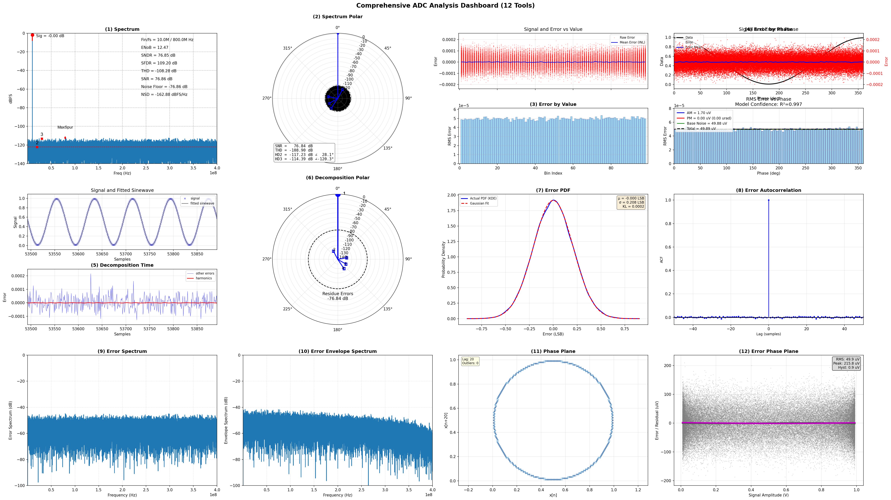
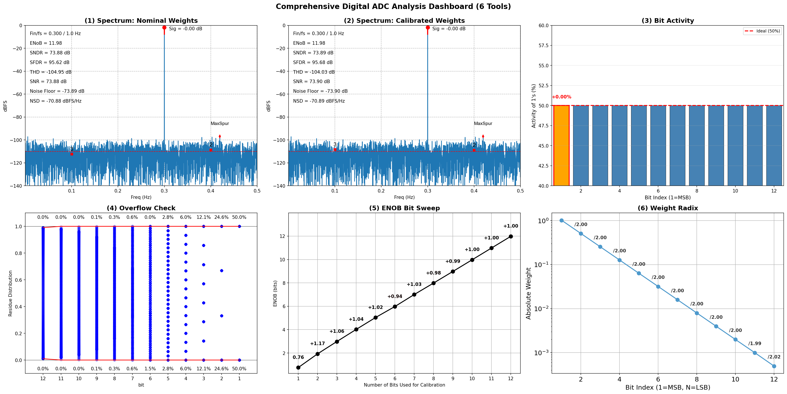

Quick Start Guide
=================

This guide will help you get started with ADCToolbox quickly.

Spectrum Analysis
-----------------

Analyze an ADC output spectrum:

.. code-block:: python

    import numpy as np
    import matplotlib.pyplot as plt
    from adctoolbox import analyze_spectrum, find_coherent_frequency

    # Generate test signal
    N = 2**13              # FFT points (8192 samples)
    Fs = 100e6             # Sampling frequency: 100 MHz
    Fin_target = 10e6      # Input frequency target: 10 MHz
    Fin, _ = find_coherent_frequency(fs=Fs, fin_target=Fin_target, n_fft=N)

    t = np.arange(N) / Fs
    A = 0.5                # Signal amplitude
    DC = 0.5               # DC offset
    noise_rms = 10e-6      # Noise RMS: 10 uVrms
    signal = A * np.sin(2*np.pi*Fin*t) + DC + np.random.randn(N) * noise_rms

    # Analyze spectrum
    plt.figure(figsize=(8, 6))
    result = analyze_spectrum(signal, fs=Fs)

    # Access metrics
    print(f"ENOB: {result['enob']:.2f} bits")
    print(f"SNDR: {result['sndr_db']:.2f} dB")
    print(f"SFDR: {result['sfdr_db']:.2f} dB")
    print(f"SNR: {result['snr_db']:.2f} dB")

    # Show the interactive plot
    plt.show()

Expected output::

    ENOB: 14.83 bits
    SNDR: 91.06 dB
    SFDR: 113.95 dB
    SNR: 91.09 dB

.. image:: quickstart_spectrum.png
   :width: 100%
   :align: center

Using Toolsets
--------------

Analog Output Dashboard
~~~~~~~~~~~~~~~~~~~~~~~

Generate a comprehensive 12-panel diagnostic dashboard for analog ADC output:

.. code-block:: python

    import numpy as np
    from adctoolbox.toolset import generate_aout_dashboard
    from adctoolbox import find_coherent_frequency

    # Generate test signal
    N = 2**16              # FFT points (65536 samples)
    Fs = 800e6             # Sampling frequency: 800 MHz
    Fin_target = 10e6      # Input frequency target: 10 MHz
    Fin, _ = find_coherent_frequency(fs=Fs, fin_target=Fin_target, n_fft=N)

    t = np.arange(N) / Fs
    A = 0.49               # Signal amplitude
    DC = 0.5               # DC offset
    noise_rms = 50e-6      # Noise RMS: 50 uVrms
    resolution = 12        # ADC resolution: 12 bits
    signal = A * np.sin(2*np.pi*Fin*t) + DC + np.random.randn(N) * noise_rms

    # Generate dashboard with 12 analysis plots
    fig, axes = generate_aout_dashboard(
        signal=signal,
        fs=Fs,
        freq=Fin,
        resolution=resolution,
        output_path='aout_dashboard.png'
    )

This generates a 3x4 panel dashboard with 12 diagnostic plots including spectrum analysis,
error characterization (PDF, autocorrelation, spectrum), polar plots, and phase plane analysis.

Digital Output Dashboard
~~~~~~~~~~~~~~~~~~~~~~~~

Generate a comprehensive 6-panel diagnostic dashboard for digital ADC bits:

.. code-block:: python

    import numpy as np
    from adctoolbox.toolset import generate_dout_dashboard
    from adctoolbox import find_coherent_frequency

    # Generate test signal
    N = 2**13              # FFT points (8192 samples)
    Fs = 1e9               # Sampling frequency: 1 GHz
    Fin_target = 300e6     # Input frequency target: 300 MHz
    Fin, _ = find_coherent_frequency(fs=Fs, fin_target=Fin_target, n_fft=N)

    t = np.arange(N) / Fs
    A = 0.49               # Signal amplitude
    DC = 0.5               # DC offset
    resolution = 12        # ADC resolution: 12 bits

    # Generate quantized signal and extract bits
    signal = A * np.sin(2*np.pi*Fin*t) + DC
    quantized_signal = np.clip(np.floor(signal * (2**resolution)), 0, 2**resolution - 1).astype(int)
    bits = (quantized_signal[:, None] >> np.arange(resolution - 1, -1, -1)) & 1

    # Generate dashboard with 6 analysis plots
    fig, axes = generate_dout_dashboard(
        bits=bits,
        freq=Fin/Fs,       # Normalized frequency
        weights=None,      # Use binary weights by default
        output_path='dout_dashboard.png'
    )

This generates a 2x3 panel dashboard with 6 diagnostic plots including spectrum before/after
calibration, bit activity, overflow detection, ENOB sweep, and weight radix visualization.

Explore More Examples
---------------------

**The best way to learn ADCToolbox is through the ready-to-run examples.**

Download all examples in one command:

.. code-block:: bash

    cd /path/to/your/workspace
    adctoolbox-get-examples

Run your first examples:

.. code-block:: bash
    cd adctoolbox_examples
    python 01_basic/exp_b01_environment_check.py    
    python 02_spectrum/exp_s01_analyze_spectrum_simplest.py
    python 02_spectrum/exp_s02_analyze_spectrum_interactive.py

All outputs are saved to the ``output/`` directory within each category.

Please refer to the :doc:`examples/index` for detailed instructions and expected outputs.