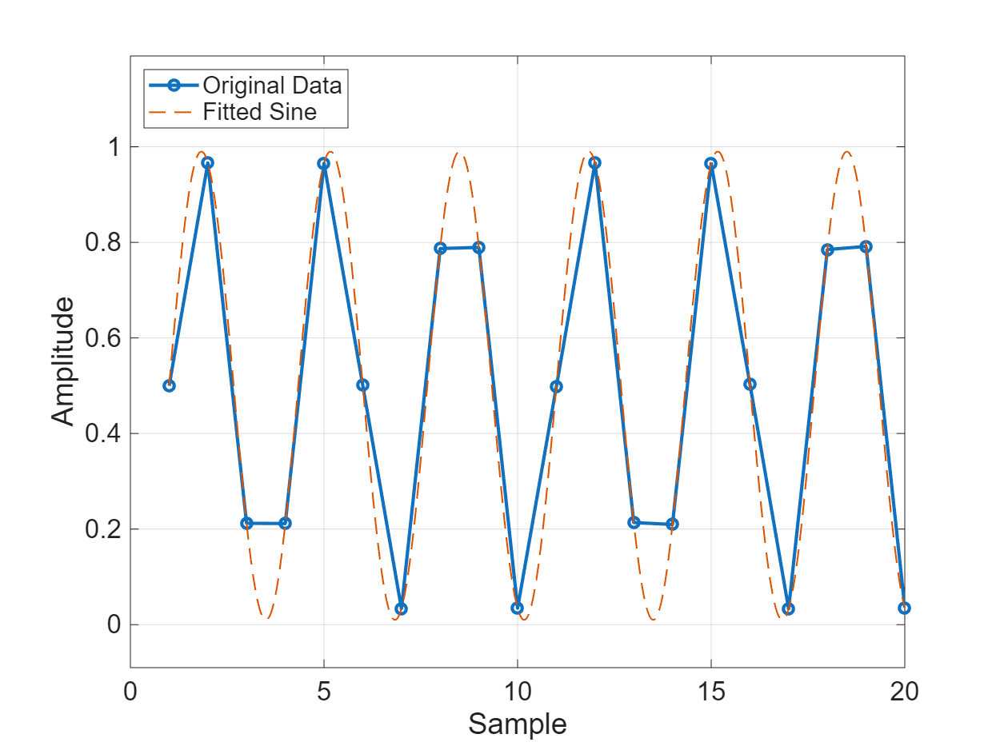
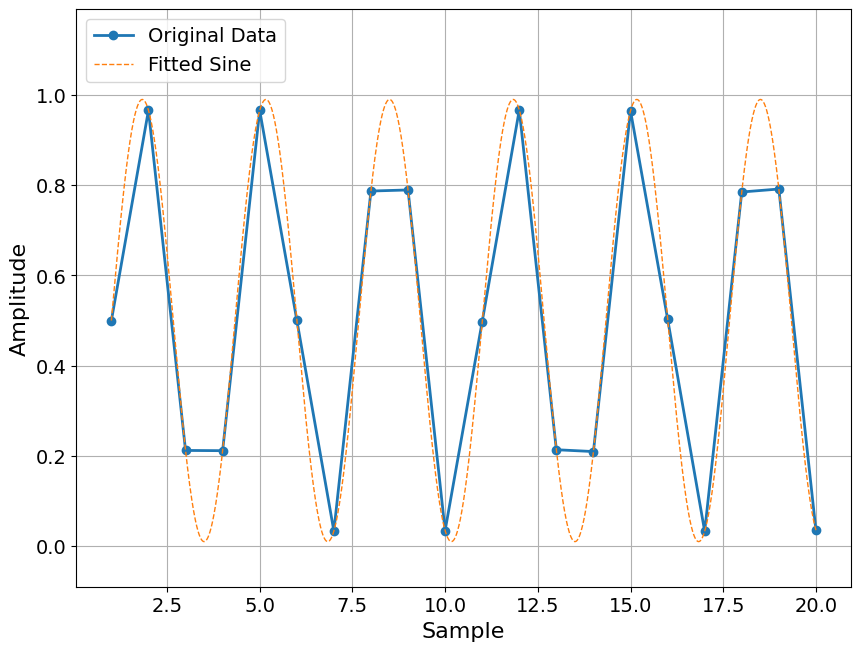

# Test Reference - Golden Reference for Cross-Platform Validation

This folder contains **golden reference outputs** from MATLAB that are used to validate Python implementation parity.

## Purpose

Since GitHub CI cannot run MATLAB (requires license), we:
1. **Commit MATLAB outputs** to this folder (CSVs + PNGs)
2. **CI runs Python** on the same inputs from `dataset/`
3. **CI compares** Python outputs against MATLAB golden reference
4. **CI passes** if Python matches MATLAB within tolerance

## Structure

```
test_reference/
├── manifest.json                   # List of test datasets
├── sinewave_jitter_400fs/         # Dataset 1
│   ├── tolerance.json             # Tolerance settings
│   ├── test_sineFit/              # Test outputs
│   │   ├── freq_matlab.csv        # MATLAB output (golden)
│   │   ├── freq_python.csv        # Python output (for comparison)
│   │   ├── mag_matlab.csv
│   │   ├── mag_python.csv
│   │   ├── sineFit_matlab.png     # MATLAB figure (for docs)
│   │   └── ...
│   ├── test_specPlot/
│   │   ├── ENoB_matlab.csv
│   │   ├── spectrum_matlab.png
│   │   ├── spectrum_python.png
│   │   └── ...
│   └── ...
└── (future datasets)
```

## Workflow

### 1. Update Golden Reference (Manual - when MATLAB changes)

```bash
# Run MATLAB tests locally
cd matlab/tests/unit
matlab -batch "test_sineFit; test_specPlot"

# This generates: test_output/sinewave_jitter_400fs/test_sineFit/*.csv + *.png

# Copy to golden reference
cp -r test_output/sinewave_jitter_400fs/test_sineFit \
      test_reference/sinewave_jitter_400fs/

# Commit to git
git add test_reference/
git commit -m "Update golden reference for sineFit"
git push
```

### 2. CI Validation (Automatic - on every push)

CI automatically:
- Loads `dataset/sinewave_jitter_400fs.csv`
- Runs Python `sine_fit()`
- Compares Python output against `test_reference/.../freq_matlab.csv`
- Passes if within tolerance specified in `tolerance.json`

### 3. Documentation (References figures)

Documentation can reference both MATLAB and Python figures:

```markdown
# sineFit.md

## Example Output

### MATLAB


### Python

```

## File Naming Convention

- `*_matlab.csv` - MATLAB output (golden reference for CI)
- `*_python.csv` - Python output (for visual comparison)
- `*_matlab.png` - MATLAB figure (for documentation)
- `*_python.png` - Python figure (for documentation)

## Tolerance Settings

Each dataset has a `tolerance.json` file specifying acceptable differences:

```json
{
  "test_sineFit": {
    "freq": {
      "atol": 0.0001,  // Absolute tolerance
      "rtol": 1e-5     // Relative tolerance
    }
  }
}
```

Validation passes if: `|python - matlab| <= atol + rtol * |matlab|`

## Datasets

See `manifest.json` for the complete list of golden reference datasets.

Currently included:
- **sinewave_jitter_400fs** - Baseline analog analysis (sineFit, specPlot, errPDF, errAutoCorrelation, tomDecomp)

## Maintenance

- Update when MATLAB implementation changes
- Review tolerance if tests fail (but verify correctness first!)
- Add new datasets as needed for comprehensive coverage

## Notes

- This folder **is committed to git** (unlike `test_output/` which is gitignored)
- Contains both data (CSV) and figures (PNG) for completeness
- Enables CI validation without running MATLAB
